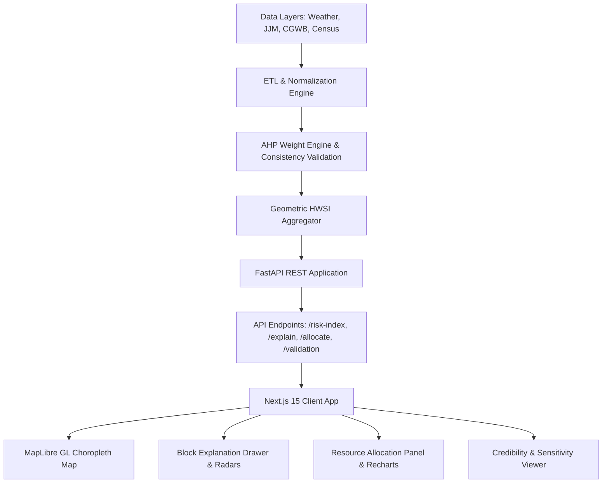

# Heat-Water Stress Decision Support System (HWSI)

[](https://fastapi.tiangolo.com/)
[](https://nextjs.org/)
[](https://reactjs.org/)
[](https://www.typescriptlang.org/)
[](https://maplibre.org/)
[](https://tailwindcss.com/)
[](https://www.python.org/)

> **An operational compound risk intelligence and optimal resource allocation platform for district disaster managers, climate planners, and public health authorities.**

---

## 📌 Table of Contents

- [Overview & Problem Statement](#-overview--problem-statement)
- [Key Capabilities](#-key-capabilities)
- [Methodology & Mathematical Framework](#-methodology--mathematical-framework)
  - [1. Multi-Indicator Structure](#1-multi-indicator-structure)
  - [2. Normalization](#2-normalization)
  - [3. Analytic Hierarchy Process (AHP)](#3-analytic-hierarchy-process-ahp)
  - [4. Geometric Risk Index Aggregation](#4-geometric-risk-index-aggregation)
  - [5. Diminishing Marginal Benefit Resource Optimizer](#5-diminishing-marginal-benefit-resource-optimizer)
- [Architecture & Tech Stack](#-architecture--tech-stack)
- [Project Directory Structure](#-project-directory-structure)
- [Getting Started](#-getting-started)
  - [Prerequisites](#prerequisites)
  - [Backend Setup (FastAPI)](#backend-setup-fastapi)
  - [Frontend Setup (Next.js)](#frontend-setup-nextjs)
- [API Reference](#-api-reference)
- [Validation & Credibility](#-validation--credibility)
- [Geographic Pilot: West Bengal, India](#-geographic-pilot-west-bengal-india)
- [Contributing & License](#-contributing--license)

---

## 🌍 Overview & Problem Statement

Climate shocks rarely strike in isolation. During peak summer, vulnerable communities frequently suffer from **compound heat and water stress**: soaring wet-bulb temperatures coinciding with groundwater depletion, erratic municipal supply, and heat-induced morbidity. 

Traditional disaster management systems assess these threats through siloed lenses:
- **Heat action plans** focus on meteorological forecasts (e.g., maximum temperature thresholds) without accounting for local water deficit or healthcare absorption capacity.
- **Drought monitoring systems** evaluate rainfall and soil moisture without assessing real-time thermal comfort or worker exposure.

**HWSI (Heat-Water Stress Index)** bridges this critical gap. It is an end-to-end decision support platform designed for district magistrates, municipal commissioners, and emergency operations centers to:
1. **Detect compound hotspots** at administrative block-level resolution using integrated hazard, exposure, and vulnerability indicators.
2. **Simulate cascading impacts** under escalating multi-day heatwave scenarios.
3. **Mathematically optimize emergency resource deployment** (water tankers and mobile cooling shelters) to maximize life-saving marginal coverage under finite budgets.
4. **Provide explainable breakdowns** of every block's risk drivers with plain-language diagnostics and mathematical consistency validation.

---

## 🚀 Key Capabilities

- 🗺️ **Interactive Geospatial Risk Explorer**: 
  High-performance vector choropleth rendering (MapLibre GL) across administrative blocks with real-time switching between **Overall HWSI**, **Heat Hazard Lens**, **Water Stress Lens**, and **Social Vulnerability**.
- 🧮 **Scientifically Grounded MCDA Engine**: 
  Analytic Hierarchy Process (AHP) with eigenvalue matrix decomposition and Saaty consistency ratio checks ($CR < 0.10$).
- 📦 **Marginal Benefit Resource Allocation Optimizer**:
  Diminishing-returns greedy knapsack optimizer distributing emergency relief units (tankers and cooling stations) with side-by-side benchmarking against *Highest-Risk First* and *Proportional* baseline policies.
- 🔍 **Block-Level Explainability & Radar Diagnostics**:
  Transparent breakdown of raw indicator values, normalized indices, weights, and human-readable automated executive summaries (e.g., *"3 warm nights forecast with heat index 42.4°C; piped water coverage at 38%"*).
- 🎚️ **Scenario Projection Simulator**:
  Interactive timeline slider simulating +0 to +7 consecutive heatwave days to model compounding infrastructure stress.
- 🎲 **Monte Carlo Robustness & Stability Analysis**:
  Evaluates ranking confidence by perturbing indicator weights across 100 randomized draws, displaying empirical stability percentages for top-tier blocks.
- 🏷️ **Data Freshness & Provenance Badges**:
  Categorizes data layers into `LIVE` (remote sensing/weather), `PERIODIC` (JJM/CGWB surveys), `STATIC` (Census), and `MOCK` (facility metrics).

---

## 🔬 Methodology & Mathematical Framework

### 1. Multi-Indicator Structure

The system models risk through three primary pillars: **Hazard ($H$)**, **Exposure ($E$)**, and **Vulnerability ($V$)**:

| Pillar | Indicator | Description | Unit | Direction | Source |
| :--- | :--- | :--- | :--- | :--- | :--- |
| **Hazard ($H$)** | Heat Index | Rothfusz apparent temperature | °C | High = Worse | Open-Meteo / ERA5 |
| | Warm Nights | Consecutive nights with $T_{min} > 26^\circ\text{C}$ | Nights | High = Worse | Remote Sensing |
| | Precipitation Deficit | Deviation from seasonal normal rainfall | % | High = Worse | IMD / Reanalysis |
| | Evapotranspiration ($ET$) | Cumulative atmospheric moisture loss | mm | High = Worse | Open-Meteo |
| | Soil Moisture Drying Rate | Soil moisture decline slope | $\Delta$ / day | High = Worse | Remote Sensing |
| | $T_{min}$ Moving Average | 3-day moving average of minimum night temp | °C | High = Worse | Station / Grid |
| **Exposure ($E$)** | Population Density | Inhabitants per square kilometer | $\text{pop}/\text{km}^2$ | High = Worse | Census 2011 |
| | Outdoor Workers | Share of agricultural & manual outdoor labor | % | High = Worse | Periodic Labor Survey |
| **Vulnerability ($V$)** | Piped Water Coverage | Jal Jeevan Mission household tap connections | % | **Inverted** (Low = Worse) | JJM Dashboard |
| | Groundwater Extraction | Extraction stage vs net annual availability | % | High = Worse | CGWB Dynamic Resource |
| | Arsenic Contamination | Chemical water contamination presence | Binary | High = Worse | State Water Lab |
| | Fluoride Contamination | Fluoride hazard presence in local aquifers | Binary | High = Worse | State Water Lab |
| | Hospital Beds per 1,000 | District health infrastructure capacity | Beds / 1k | **Inverted** (Low = Worse) | Health Bulletin |
| | Vulnerable Demographics | Proportion of children (<6) and elderly (>65) | % | High = Worse | Census |

### 2. Normalization

All indicators are normalized to $[0, 1]$ using directional min-max scaling bounded by domain thresholds:

$$\text{Direct:} \quad I_{\text{norm}} = \text{clip}\left(\frac{x - \text{min}}{\text{max} - \text{min}}, 0, 1\right)$$

$$\text{Inverted:} \quad I_{\text{norm}} = 1 - \text{clip}\left(\frac{x - \text{min}}{\text{max} - \text{min}}, 0, 1\right)$$

### 3. Analytic Hierarchy Process (AHP)

Indicator and component weights are derived from pairwise comparison matrices via the principal eigenvector:

$$A w = \lambda_{\max} w$$

Consistency is mathematically validated using Saaty's Consistency Ratio ($CR = \frac{CI}{RI}$), ensuring transitivity and minimizing subjective bias:
$$\text{Consistency Index } (CI) = \frac{\lambda_{\max} - n}{n - 1}$$
All component matrices maintain $CR < 0.10$.

### 4. Geometric Risk Index Aggregation

To prevent high resilience in one pillar from masking critical vulnerabilities in another, HWSI employs **multiplicative geometric aggregation**:

$$\text{HWSI}_i = H_i^{w_H} \times E_i^{w_E} \times V_i^{w_V}$$

Where $w_H + w_E + w_V = 1$. Blocks are classified into four risk bands:
- **Low**: $\text{HWSI} < 0.25$
- **Moderate**: $0.25 \le \text{HWSI} < 0.50$
- **High**: $0.50 \le \text{HWSI} < 0.75$
- **Very High**: $\text{HWSI} \ge 0.75$

### 5. Diminishing Marginal Benefit Resource Optimizer

Emergency relief units exhibit diminishing returns as more units are dispatched to the same area. The system implements a nonlinear response function for resource $r \in \{\text{tankers}, \text{cooling\_units}\}$:

$$B_i(u) = \text{Pop}_i \times \text{Need}_i^r \times \left(1 - e^{-k_r \cdot u}\right)$$

Where:
- $\text{Need}_i^{\text{tankers}} = H_i^{0.4} \times V_i^{0.6}$ (water deficits dominate)
- $\text{Need}_i^{\text{cooling}} = H_i^{0.6} \times V_i^{0.4}$ (thermal extremes dominate)
- $k_r$ is the saturation coefficient ($k_{\text{tanker}} = 0.5$, $k_{\text{cooling}} = 0.2$)

At each step, the greedy optimizer allocates unit $u+1$ to the block maximizing the marginal benefit:

$$\Delta B_i(u) = B_i(u + 1) - B_i(u)$$

This guarantees near-optimal resource allocation superior to naive heuristic ranking.

---

## 🛠️ Architecture & Tech Stack



### Backend
- **FastAPI**: Async, high-performance web framework.
- **Pandas & NumPy**: Fast vector operations and dataframe transformations.
- **SciPy**: Eigenvalue calculations and statistical distributions.
- **Pydantic v2**: Strict API request and response data contract schemas.

### Frontend
- **Next.js 15 (App Router)** & **React 18**: Modern, responsive user interface.
- **TypeScript**: End-to-end typed contracts matching backend schemas.
- **MapLibre GL** & **react-map-gl**: GPU-accelerated client-side choropleth rendering.
- **Tailwind CSS** & **Radix UI**: Accessible, sleek design system.
- **Recharts**: Comparative bar charts and allocation distributions.
- **SWR**: Reactive client-side data fetching and caching.

---

## 📂 Project Directory Structure

```text
hwsi/
├── .gitignore                    # Root git exclusion rules (venv, node_modules, .next)
├── README.md                     # Comprehensive documentation
├── backend/
│   ├── requirements.txt          # Python dependencies
│   ├── generate_data.py          # Synthetic data generator for pilot districts
│   ├── demo_snapshot.json        # Precomputed GeoJSON snapshot for offline demo
│   ├── data/                     # Data stores (Census, JJM, CGWB, Contamination, GeoJSON)
│   │   ├── block_id_map.csv
│   │   ├── blocks.geojson
│   │   ├── census/
│   │   ├── contamination/
│   │   ├── groundwater/
│   │   ├── health/
│   │   └── jjm/
│   └── app/
│       ├── main.py               # FastAPI entry point & startup computation
│       ├── config.py             # AHP matrices, indicator thresholds, and parameters
│       ├── models.py             # Pydantic data schemas
│       ├── data/
│       │   ├── loader.py         # Multi-source dataset loader and merger
│       │   └── weather.py        # Meteorological data fetching
│       ├── engine/
│       │   ├── ahp.py            # AHP eigenvalue weights & Consistency Ratio calculation
│       │   ├── etl.py            # Feature engineering and preprocessing
│       │   ├── hwsi.py           # Geometric HWSI computation and lens derivation
│       │   ├── normalize.py      # Min-max indicator scaling
│       │   └── sensitivity.py    # Monte Carlo weight perturbation analysis
│       ├── optimizer/
│       │   ├── allocator.py      # Greedy marginal benefit resource optimizer
│       │   └── baselines.py      # Heuristic baselines (Highest HWSI, Proportional)
│       └── routers/
│           ├── allocate.py       # /api/v1/allocate
│           ├── explain.py        # /api/v1/blocks/{id}/explain
│           ├── risk.py           # /api/v1/blocks/risk-index, /api/v1/blocks.geojson
│           ├── status.py         # /api/v1/data-status
│           └── validation.py     # /api/v1/validation
├── frontend/
│   ├── package.json              # Next.js scripts and frontend dependencies
│   ├── tsconfig.json             # TypeScript configuration
│   ├── tailwind.config.ts        # Tailwind theme and colors
│   ├── public/
│   │   └── blocks.geojson        # Publicly served geometry for web maps
│   └── src/
│       ├── app/
│       │   ├── globals.css       # Tailwind base styles
│       │   ├── layout.tsx        # Shell layout
│       │   └── page.tsx          # Main dashboard view
│       ├── components/
│       │   ├── charts/           # Allocation comparison charts
│       │   ├── common/           # Data badges, scenario sliders
│       │   ├── map/              # MapLibre risk map, legend, layer toggles
│       │   └── sidebar/          # Explainer tabs, allocation controls, credibility panel
│       ├── hooks/                # SWR hooks (useRiskData, useBlockExplain, useAllocation)
│       └── lib/                  # API client, types, utility functions, constants
└── notebooks/
    └── .gitkeep                  # Exploratory research notebooks
```

---

## ⚡ Getting Started

### Prerequisites

- **Python**: 3.10 or higher
- **Node.js**: 18.0 or higher
- **npm** or **yarn** / **pnpm**

---

### Backend Setup (FastAPI)

1. **Navigate to the backend directory**:
   ```bash
   cd backend
   ```

2. **Create and activate a virtual environment**:
   ```bash
   # On macOS/Linux
   python3 -m venv venv
   source venv/bin/activate

   # On Windows
   python -m venv venv
   .\venv\Scripts\activate
   ```

3. **Install dependencies**:
   ```bash
   pip install -r requirements.txt
   ```

4. **Run the API server**:
   ```bash
   uvicorn app.main:app --host 0.0.0.0 --port 8000 --reload
   ```

5. The API will be accessible at `http://localhost:8000`. You can test interactive API documentation at `http://localhost:8000/docs`.

---

### Frontend Setup (Next.js)

1. **Navigate to the frontend directory**:
   ```bash
   cd frontend
   ```

2. **Install node dependencies**:
   ```bash
   npm install
   ```

3. **Launch the development server**:
   ```bash
   npm run dev
   ```

4. Open [http://localhost:3000](http://localhost:3000) in your web browser.

---

## 📡 API Reference

| Method | Endpoint | Description |
| :--- | :--- | :--- |
| `GET` | `/health` | Health check endpoint returning `{ status: "ok" }`. |
| `GET` | `/api/v1/blocks/risk-index?extra_days={0-7}` | Returns HWSI scores, risk bands, ranks, and lens values for all blocks. |
| `GET` | `/api/v1/blocks.geojson` | GeoJSON polygons with embedded HWSI properties for map rendering. |
| `GET` | `/api/v1/blocks/{block_id}/explain` | Detailed decomposition of hazard, exposure, and vulnerability indicators with textual summaries. |
| `POST` | `/api/v1/allocate` | Computes optimal allocation for specified tanker and cooling unit counts, comparing against baselines. |
| `GET` | `/api/v1/validation` | Returns AHP Consistency Ratio, Monte Carlo stability, and backtest results. |
| `GET` | `/api/v1/data-status` | Provenance and update frequencies for all connected data sources. |

### Sample Allocation Payload
```json
POST /api/v1/allocate
Content-Type: application/json

{
  "tankers": 25,
  "cooling_units": 15,
  "extra_days": 2
}
```

---

## 🛡️ Validation & Credibility

A major limitation of decision support tools in disaster governance is the "black-box" dilemma. HWSI addresses this with three layers of scientific validation:

1. **AHP Consistency Ratio ($CR$)**:
   - Every pairwise matrix undergoes eigenvalue consistency checks.
   - Matrices comply with Saaty's standard threshold ($CR < 0.10$).
2. **Monte Carlo Sensitivity Analysis**:
   - Indicator weights are perturbed by $\pm 20\%$ across 100 iterations.
   - The platform calculates the percentage of iterations in which top-ranked blocks remain within the highest priority band, guaranteeing that administrative interventions are resilient to weight variations.
3. **Multi-Source Transparency**:
   - Every metric exposed via the interface provides its provenance (`LIVE`, `PERIODIC`, `STATIC`, or `MOCK`) and exact units of measure.

---

## 📍 Geographic Pilot: West Bengal, India

The initial pilot focuses on 56 administrative blocks across three climatically and demographically distinct districts in West Bengal:

- **Purulia District (20 Blocks)**:
  Arid plateau fringe, hard-rock aquifers, frequent groundwater overdraft, vulnerable to severe dry-heat spells and fluoride contamination.
- **Bankura District (22 Blocks)**:
  Transition zone characterized by intense summer thermal peaks, high agrarian outdoor labor exposure, and erratic summer precipitation.
- **Howrah District (14 Blocks)**:
  High-density alluvial delta district prone to compound wet-bulb humidity stress, low per-capita hospital bed capacity, and high exposure.

---

## 🤝 Contributing & License

Contributions, issues, and feature proposals are welcome! 

1. Fork the repository
2. Create your feature branch (`git checkout -b feature/climate-resilience-enhancement`)
3. Commit your changes (`git commit -m 'Add climate resilience feature'`)
4. Push to the branch (`git push origin feature/climate-resilience-enhancement`)
5. Open a Pull Request

Distributed under the **MIT License**. See `LICENSE` for more information.
